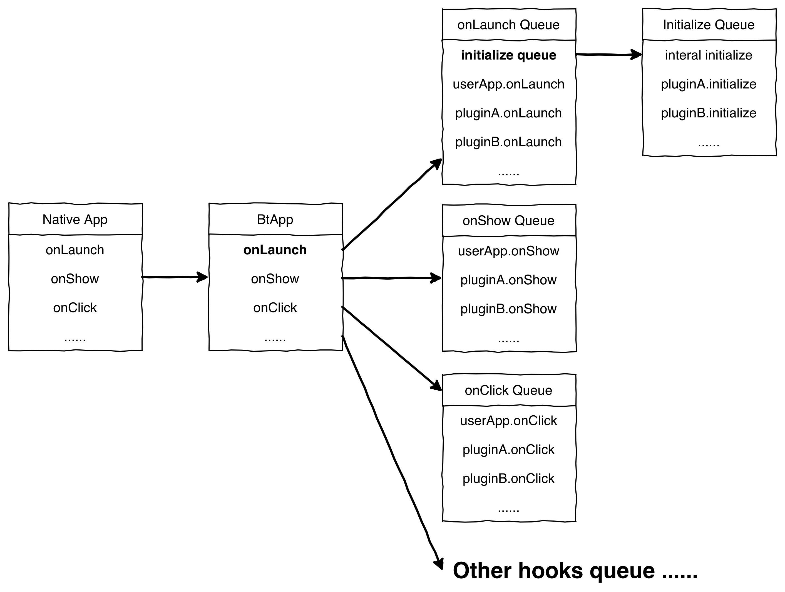

# 原理

## 宿主的可插件化

BeautyWe 会对宿主进行「可插件化」处理，经过这一步骤，才能把宿主的能力开放给插件。    
从而才能通过插件实现复杂逻辑的封装。

「可插件化」也是 BeautyWe 的核心逻辑，这里会一一讲解插件是怎么装载到宿主中去的。

由于，`App` 和 `Page` 可插件化的思路是一致的，只有某些生命周期钩子不太一样。    
为了避免啰嗦，后续只用 `App` 来说明。

当执行代码 `const app = new BtApp(userApp)` 的时候，「可插件化」就会开始工作，最后输出的 `app`，是已经过可插件化的了。
如果你尝试打印 `app.onLaunch` 和 `userApp.onLaunch`，你会发现是不一样的函数。

为了方便理解，对这过程中的抽象，我们约定一下理解：
1. **Native App**: `App(app)` 生成的实例，是微信小程序原生的 App 实例
2. **BtApp**: `BtApp(userApp)` 生成的实例，是 BeautyWe 包装的 BtApp 实例
3. **User App**: `BtApp(userApp)` 中的 `userApp`，是我们实现具体业务代码的时候，由用户定义的 App

宿主与插件的执行循序，简单来说就如下图：


以 `onShow` 来举例，
- 当 `app.onShow` 执行，
- 会执行 `btApp.onShow`，
- 然后执行 `userApp.onShow`，
- 然后执行 `pluginA.onShow`，
- 然后执行 `pluginB.onShow`，
- 然后...

简单的理解的话，上图是没问题的，但是要深入理解「可插件化」，还需要继续剖析实现原理：



经过 `BtApp` 包装，所有的钩子函数 (native hook 和 handler)，都会有一个独立的执行队列，    
这个队列首先会存储 `User App` 对应的钩子函数，然后每当有插件装载的时候，都会往执行队列 `push`。    
当 `Native App` 触发某个钩子函数，`BtApp` 就会以 Promise 链的形式按循序执行对应执行队列里面的函数。    

特殊的，`onLaunch` 和 `onLoad` 的执行队列中，会在队列顶部插入一个初始化的函数（`initialize`），这个函数会以同步的方式按循序执行 `Initialize Queue` 里面的函数。    
而 `Initialize Queue` 存放的函数，正是插件生命周期函数中的 `plugin.initialize`。

以上，就支持了：
1. 宿主的可插件化
2. 钩子函数支持异步阻塞

## 插件的四种能力

经过「可插件化」之后，[宿主](contents/core/the-host.md) 的一些能力被开放了出来。    
插件的能力可以分成四类：

1. 扩展宿主数据：Data，对应 `plugin.data`
2. 扩展宿主原生钩子：Native Hook，对应 `plugin.nativeHook`
3. 扩展宿主事件监听钩子：Handler Hook，对应 `plugin.handler`
4. 供外部调用的 API：Custom Method，对应 `plugin.custeomMethod`

### 数据 Data
每个插件，在宿主的 data 中，都会有一个专有的命名空间：

```javascript
import event from '@beautywe/plugin-event';
import beautywe from '@beautywe/core';

// in app.js
const myApp = new beautywe.BtApp();
App(myApp);

// in xxx/page.js
const myPage = new beautywe.BtPage({...});
Page(myPage);

// use event plugin
myApp.use(event());
myPage.use(event());

// 提供给插件使用的命名空间
myApp.data.event;
myPage.data.event;
```

该功能，主要用于满足某些插件功能需要与视图层进行交互的场景。

### 原生钩子 Native Hook

在 BeautyWe 中，你可以在插件中处理宿主的生命周期回调函数：

```javascript
const myPlugin = {
    nativeHook: {
        onLaunch(options) {
            // do your logic
        },
        onLoad() {
            // do your logic
        },
    }
};
```

并且支持多个插件与页面之间共同监听同一个生命周期钩子：

```javascript
const pluginA = {
    nativeHook: {
        onShow: onShowForPluginA(options) {
            // do your logic
            console.log('onShow on pluginA');
        },
    }
};

const pluginB = {
    nativeHook: {
        onShow: onShowForPluginB(options) {
            // do your logic
            console.log('onShow on pluginB');
        },
    }
});

const app = new BeautyWe.BtApp({
    onShow: originOnShow(options) {
        // do your logic
        console.log('onShow on the host');
    },
};

app.use([pluginA, pluginB]);

App(app);

// 当页面被载入，调用 app.onShow() 时，会是这样的输出：
// onShow on the host
// onShow on pluginA
// onShow on pluginB
```

甚至还支持以返回 Promise 的形式来对执行过程异步化

```javascript
const pluginA = {
    nativeHook: {
        onShow: onShowForPluginA(options) {
            // do your logic
            console.log('onShow on pluginA');
        },
    }
});

const pluginB = {
    nativeHook: {
        onShow: onShowForPluginB(options) {
            // do your logic
            console.log('onShow on pluginB');
        },
    }
});

const app = new BeautyWe.BtApp({
    onShow: originOnShow(options) {
        // do your logic

        return Promise
            .resolve()
            .then(() => console.log('fetching data'))
            .then(() => xxxAPI.fetch())
            .then(() => console.log('fetching data done'))
            .then(() => console.log('onShow on the host'))
    },
});

app.use([pluginA, pluginB]);

App(app);

// 当页面被载入，调用 app.onShow() 时，会是这样的输出：
// fetching data
// fetching data done
// onShow on the host
// onShow on pluginA
// onShow on pluginB
```


`plugin.nativeHook` 支持识别的钩子函数有：
``` javascript
// app
const APP_NATIVE_HOOKS = [
    'onLaunch',
    'onShow',
    'onHide',
    'onPageNotFound',
];

// page
const PAGE_NATIVE_HOOKS = [
    'onLoad',
    'onShow',
    'onReady',
    'onHide',
    'onUnload',
    'onPullDownRefresh',
    'onReachBottom',
    'onPageScroll',
    'onResize',
    'onTabItemTap',
];
```

### 事件处理 Handler

为满足插件可以实现与视图层的交互逻辑封装，除了给与插件 data 的能力，还需要给予事件处理的能力。    
你可以在插件中这样实现事件的监听：

```javascript
const pluginA = {
    handler: {
        onBtnClick(e) {
            // do your logic
        },
    }
};

const pluginB = {
    handler: {
        onBtnClick(e) {
            // do your logic
        },
    }
};

const myPage = new beautywe.BtPage({
    onBtnClick(e) {
        // do your logic
    },
});

// 多个插件和宿主都能实现同一个事件函数，实现原理与 Native Hook 一致。
myPage.use([pluginA, pluginB]);

Page(myPage);
```

### 自定义方法 Custom Method

Custom method 是能让插件给用户提供一系列 API 的方式：

```javascript
const myPlugin = {
    name: 'myPlugin',
    data: {
        name: 'myPlugin',
    },
    customMethod: {
        hello() {
            // this 指向的是当前宿主实例
            console.log(`Hello, I am ${this.data.myPlugin.name}`);
        },
        international: {
            bonjour() {
                // this 依然指向的是当前宿主实例
                console.log(`Bonjour, je suis ${this.data.myPlugin.name}`);
            },

            nihao() {
                // this 依然指向的是当前宿主实例
                console.log(`你好, 我是 ${this.data.myPlugin.name}`);
            }
        }
    }
};

const myPage = new beautywe.BtPage({
    onLoad() {
        // 输出：Hello, I am myPlugin
        this.myPlugin.hello();
    }
});

myPage.use(myPlugin);

Page(myPage);
```

custom method 混合的大概过程如下：
1. 以插件名，在 page 增加一块命名空间：`page.myPlugin = {}`;
2. 按照 `customMethod` 的树桩结构，把函数绑定到 `page.myPlugin` 上面；
3. 实现这个操作的函数，在 `Initialize Queue` 中，也即是 `onLaunch/onLoad` 触发的时候会被执行。

## 插件的生命周期

关于插件，实际只有两个动作：

1. 装载 Attach
2. 初始化 Initialize

至于卸载，则是跟着宿主被销毁了（`App.onHide`, `Page.onHide`, `Page.onUnload`）

### 装载

在执行 `theHost.use(plugin)` 的时候，触发装载动作，该动作有两个钩子函数：
* `beforeAttach({ theHost })`
* `attached({ theHost })`

其中 `theHost` 是由 `Page()` 或 `App()` 创建的原生实例。
函数中执行 `throw`，会阻断执行。

### 初始化

根据上面 [宿主的可插件化](#宿主的可插件化) 原理，插件的初始化是在原生宿主实例载入的时候(`App.onLaunch`, `Page.onLoad`)被执行的。
该过程的钩子函数：
* initialize({ theHost }) 

该初始化钩子函数会被 push 到 `Initialize Queue` 中，    
函数中执行 `throw`, 会阻断执行。
